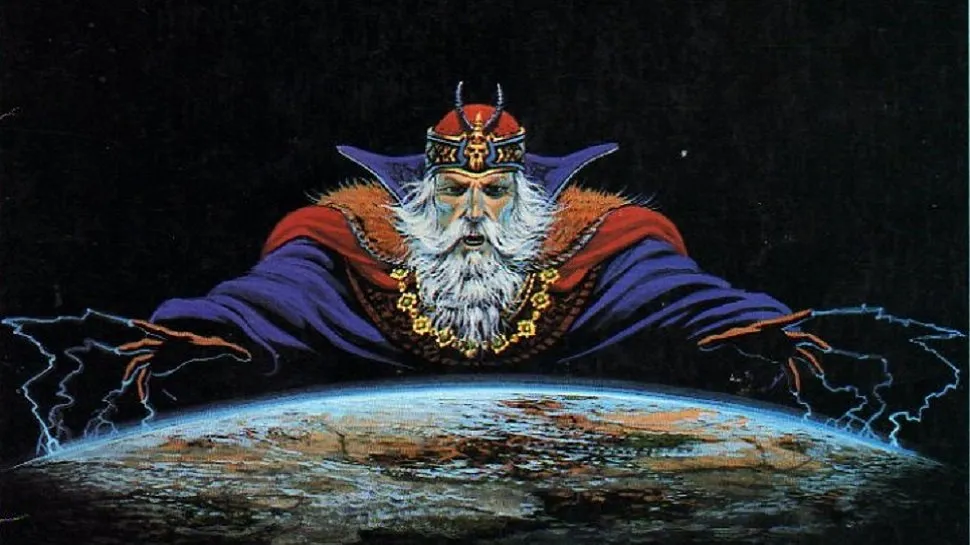

# Awesome Games Master

  
   
  

> Useful resources for running table-top role playing games

## Contents
* [World building](#world-building)
* [Battle maps](#battle-maps)
* [Running the game](#running-the-game)
* [References](#references)
* [Random generators](#random-generators)
* [Organisation](#organisation)
* [Tutorials](#tutorials)

## World building
- [Wonderdraft](https://www.wonderdraft.net/)
- [Inkarnate](https://inkarnate.com/)
- [World Anvil](https://www.worldanvil.com/)
- [Statblock builder](https://tetra-cube.com/dnd/dnd-statblock.html)

## Battle maps
- [Dungeondraft](https://dungeondraft.net/)
- [Dungeon generator](https://dungen.app/dungen/) - Generates random dungeons with some customization.
- [Dungeon scrawl](https://dungeonscrawl.com/)
- [Token maker](https://rolladvantage.com/tokenstamp/)

## Running the game
- [MapTool](https://www.rptools.net/toolbox/maptool/) - An advanced open source tool for running games with advanced vision blocking and macro support.
- [FoundryVTT](https://foundryvtt.com/) - A modern role playing platform with a large community and developer base and integrates with many other tools.
- [Fantasy Grounds](http://www.fantasygrounds.com/home/home.php) - A role playing platform with support for many systems.
- [Owlbear Rodeo](https://www.owlbear.rodeo/)  - A very simple browser based platform that is easy to pick up and requires minimal setup.
- [Roll20](https://roll20.net/) - A popular role playing platform with lots of documentation.
- [Mythic table](https://www.mythictable.com/) - Still in development open source platform.
- [Astral Tabletop](https://www.astraltabletop.com/) - An online platform with built in maps and assets.

- [The monsters know](https://www.themonstersknow.com/)

## References
- [Cartography Assets](http://cartographyassets.com/)
- [Dialects archive](https://www.dialectsarchive.com/)
- [Character art](https://www.pinterest.co.uk/efilean/)

## Random generators
- [Watabou](https://watabou.itch.io)  - Home of many procedural generators.
  * [Medieval fantasy city generator](https://watabou.itch.io/medieval-fantasy-city-generator) - City generator with several customization options.
  * [Village generator](https://watabou.itch.io/village-generator) - Simple village generator.
- [Fantasy map generator](https://azgaar.github.io/Fantasy-Map-Generator/) - Open source world map generator with a lot of customization.
- [Town generator](https://eigengrausgenerator.com/) - A generator for town buildings and characters with narration.
- [DnD 5e / Coriolis store generator](http://dndstores.azurewebsites.net/index.html) - Generates the stock and prices of stores based on city size.
- [Dungeon generator](https://dungen.app/dungen/) - Generates random dungeons with some customization.

## Organisation

## Tutorials
